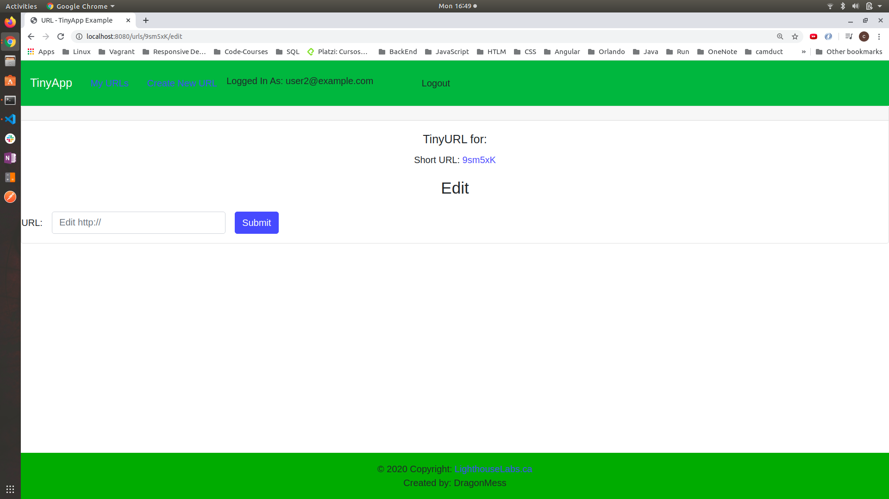
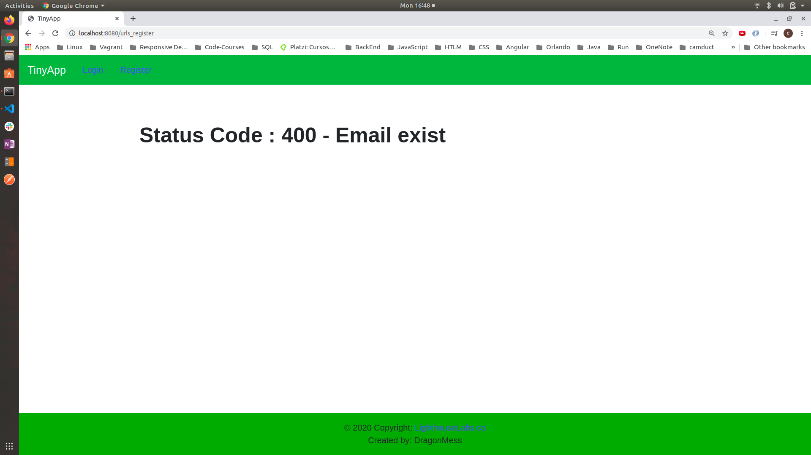

# TinyApp Project

TinyApp is a full stack web application built with Node and Express that allows users to shorten long URLs (à la bit.ly).

## Final Product

### Login

### Register

### User Loged

### Create New URL

### Edit URL

### Error Message - Email exist

### Error Message - Empty Form

## Dependencies

- Node.js
- Express
- EJS
- body-parser
- cookie-session
- morgan
- bcrypt

## Dev - Dependencies

- chai
- eslint
- mocha
- nodemon

## Getting Started

- Install all dependencies (using the `npm install` command).
- Run the development web server using the `node express_server.js` command.